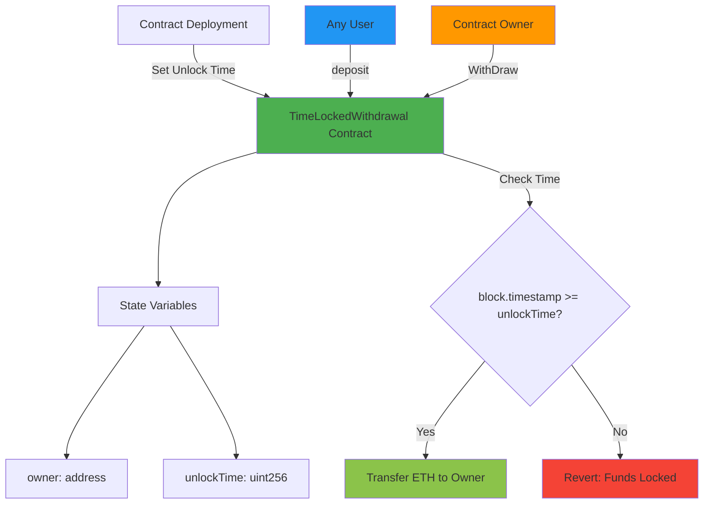
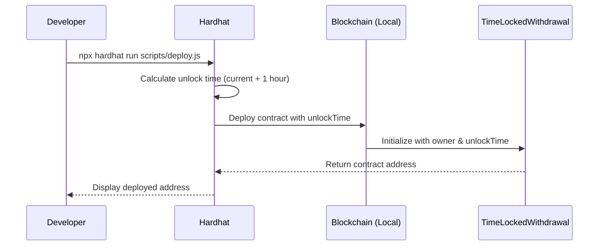
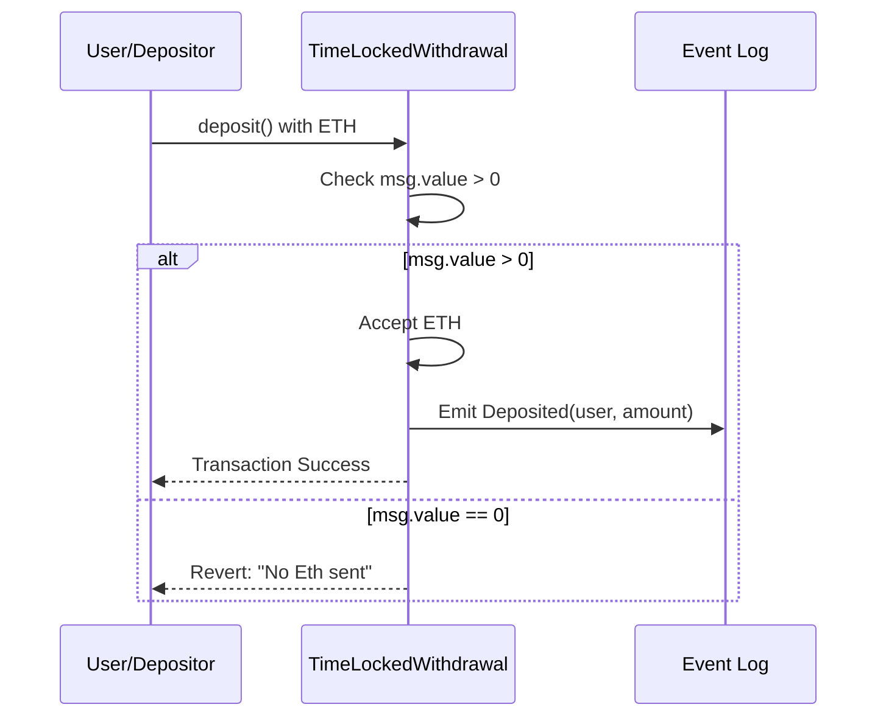
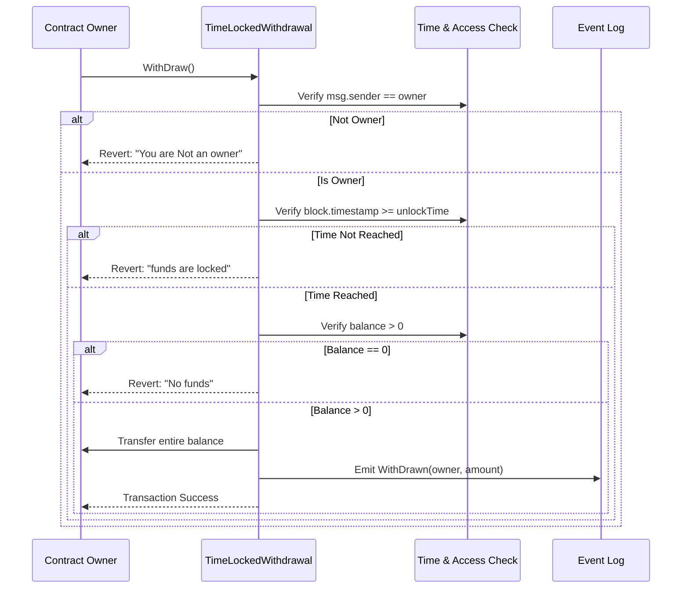

# TimeLocked Withdrawal Smart Contract

<div align="center">
  
  
  
  
</div>

<div align="center">
  <h3>A secure Ethereum smart contract that locks funds until a specified unlock time</h3>
  <p>Perfect for time-based vesting, savings, or escrow scenarios</p>
</div>

---

## Table of Contents

- [Overview](#overview)
- [Features](#features)
- [Architecture](#architecture)
- [Workflow](#workflow)
- [Getting Started](#getting-started)
- [Contract Details](#contract-details)
- [Deployment](#deployment)
- [Usage Examples](#usage-examples)
- [Security Considerations](#security-considerations)
- [Technology Stack](#technology-stack)
- [Author](#author)
- [License](#license)

---

## Overview

The TimeLockedWithdrawal contract provides a simple yet powerful mechanism to lock Ethereum funds until a predetermined time. The contract owner can set a future unlock time during deployment, and only after that time can the owner withdraw the accumulated funds.

### Key Highlights

- **Time-Based Locking**: Funds remain locked until the specified unlock time
- **Owner-Only Withdrawals**: Secure withdrawal mechanism restricted to contract owner
- **Public Deposits**: Anyone can deposit ETH to the contract
- **Event-Driven**: Comprehensive event emissions for transparency
- **Deployed Locally**: Currently running on local Hardhat network

---

## Features

| Feature | Description |
|---------|-------------|
| **Time Lock Mechanism** | Set a future timestamp when deploying the contract to lock funds |
| **Owner Authentication** | Only the contract deployer can withdraw funds |
| **Flexible Deposits** | Accept deposits from any address at any time |
| **Event Logging** | Track all deposits and withdrawals on-chain |
| **Secure Transfers** | Uses low-level call for secure ETH transfers |
| **Balance Checking** | Prevents withdrawals when balance is zero |

---

## Architecture

<div align="center">



</div>

---

## Workflow

### Deployment Flow

<div align="center">



</div>

### Deposit Flow

<div align="center">



</div>

### Withdrawal Flow

<div align="center">



</div>

---

## Getting Started

### Prerequisites

Before you begin, ensure you have the following installed:

- **Node.js** (v16.0.0 or higher)
- **npm** or **yarn**
- **Git**
- **Hardhat**

### Installation

```bash
# Clone the repository
git clone https://github.com/Siddheshwar-cloud/timelock-withdrawal.git
cd timelock-withdrawal

# Install dependencies
npm install
```

### Project Structure

```
timelock-withdrawal/
├── contracts/
│   └── TimeLockedWithdrawl.sol
├── scripts/
│   └── deploy.js
├── hardhat.config.js
├── package.json
└── README.md
```

---

## Contract Details

### State Variables

```solidity
address public owner;        // Contract owner (deployer)
uint256 public unlockTime;   // Unix timestamp for unlock
```

### Constructor

```solidity
constructor(uint256 _unlockTime)
```

**Parameters:**
- `_unlockTime`: Unix timestamp (must be in the future)

**Requirements:**
- `_unlockTime` must be greater than `block.timestamp`

### Functions

#### deposit()

```solidity
function deposit() external payable
```

Allows anyone to deposit ETH into the contract.

**Requirements:**
- `msg.value` must be greater than 0

**Events Emitted:**
- `Deposited(address indexed from, uint256 amount)`

---

#### WithDraw()

```solidity
function WithDraw() external onlyOwner
```

Allows the owner to withdraw all funds after the unlock time.

**Requirements:**
- Caller must be the contract owner
- Current time must be >= unlock time
- Contract balance must be > 0

**Events Emitted:**
- `WithDrawn(address indexed to, uint256 amount)`

---

### Modifiers

```solidity
modifier onlyOwner()
```

Restricts function access to the contract owner only.

---

### Events

```solidity
event Deposited(address indexed from, uint256 amount);
event WithDrawn(address indexed to, uint256 amount);
```

---

## Deployment

### Local Network Deployment

The contract is currently deployed on a local Hardhat network.

```bash
# Start local Hardhat node (Terminal 1)
npx hardhat node

# Deploy contract (Terminal 2)
npx hardhat run scripts/deploy.js --network localhost
```

### Deployment Script Breakdown

The deployment script (`scripts/deploy.js`) performs the following:

1. Calculates unlock time (current time + 1 hour)
2. Gets the contract factory
3. Deploys the contract with the unlock time
4. Waits for deployment confirmation
5. Logs the deployed contract address

**Default Lock Period:** 1 hour (3600 seconds)

---

## Usage Examples

### Interacting with the Contract

#### Using Hardhat Console

```javascript
// Start Hardhat console
npx hardhat console --network localhost

// Get contract instance
const Contract = await ethers.getContractFactory("TimeLockedWithdrawl");
const contract = await Contract.attach("YOUR_CONTRACT_ADDRESS");

// Check unlock time
const unlockTime = await contract.unlockTime();
console.log("Unlock Time:", new Date(unlockTime * 1000));

// Deposit ETH
const depositTx = await contract.deposit({ value: ethers.parseEther("1.0") });
await depositTx.wait();

// Check balance
const balance = await ethers.provider.getBalance(contract.target);
console.log("Contract Balance:", ethers.formatEther(balance), "ETH");

// Withdraw (after unlock time)
const withdrawTx = await contract.WithDraw();
await withdrawTx.wait();
```

#### Using Ethers.js Script

```javascript
const { ethers } = require("hardhat");

async function interact() {
  const contractAddress = "YOUR_CONTRACT_ADDRESS";
  const Contract = await ethers.getContractAt("TimeLockedWithdrawl", contractAddress);
  
  // Deposit 0.5 ETH
  const tx = await Contract.deposit({ 
    value: ethers.parseEther("0.5") 
  });
  await tx.wait();
  console.log("Deposited 0.5 ETH");
}

interact();
```

---

## Security Considerations

### Access Control

<div align="center">

| Aspect | Implementation |
|--------|----------------|
| **Owner Assignment** | Set once at deployment, immutable |
| **Withdrawal Access** | Protected by `onlyOwner` modifier |
| **Deposit Access** | Public, anyone can deposit |

</div>

### Time Lock Security

- Unlock time is validated at deployment (must be future timestamp)
- Withdrawal function checks current time against unlock time
- Prevents premature withdrawals through require statements

### Transfer Security

- Uses low-level `.call{value: balance}("")` for ETH transfers
- Checks return value to ensure successful transfer
- Reverts transaction if transfer fails

### Known Limitations

1. **Single Owner**: No multi-signature support
2. **Fixed Unlock Time**: Cannot be modified after deployment
3. **No Partial Withdrawals**: Withdraws entire balance at once
4. **No Emergency Withdrawal**: Owner must wait until unlock time

### Best Practices Applied

- Input validation on all functions
- Event emission for state changes
- Use of modifiers for access control
- Explicit error messages in require statements

---

## Technology Stack

<div align="center">

| Technology | Version | Purpose |
|------------|---------|---------|
| **Solidity** | ^0.8.20 | Smart contract language |
| **Hardhat** | Latest | Development framework |
| **Ethers.js** | v6 | Blockchain interaction library |
| **Node.js** | v16+ | Runtime environment |

</div>

### Development Tools

- **Hardhat Network**: Local blockchain for development
- **Hardhat Console**: Interactive JavaScript environment
- **Solidity Compiler**: Contract compilation

---

## Use Cases

### Personal Finance

```
Scenario: Self-imposed savings lock
User deposits ETH and sets unlock time to 6 months
Funds remain inaccessible until the time period ends
Helps with disciplined saving and preventing impulsive spending
```

### Vesting Schedules

```
Scenario: Team member token vesting
Deploy contract with 1-year lock period
Deposit team member's allocation
Member can claim after vesting period completes
```

### Time-Based Escrow

```
Scenario: Service agreement payment
Client deposits payment with future unlock time
Service provider becomes owner
Provider can withdraw after service completion date
```

### Trust Funds

```
Scenario: Future inheritance
Parent deposits funds with unlock time at child's 18th birthday
Child becomes owner and can withdraw when eligible
Ensures funds are preserved until maturity
```

---

## Author

<div align="center">
  
</div>

**Sidheshwar Yengudle**

solidity | Smart Contract Developer

<div align="center">

[](https://github.com/Siddheshwar-cloud)
[](https://www.linkedin.com/in/sidheshwar-yengudle-113882241/)
[](https://x.com/SYangudale)

</div>

---

## Show Your Support

If you found this project helpful or interesting, please consider giving it a star!

<div align="center">
  
[](https://github.com/Siddheshwar-cloud/TimeLockedWithdrawal-)

**Your star motivates me to create more open-source projects!**

</div>

### How to Star This Repository

1. Click the **Star** button at the top right of this page
2. Share this project with others who might find it useful
3. Follow me on GitHub for more blockchain projects

---

## Contributing

Contributions, issues, and feature requests are welcome!

### How to Contribute

1. Fork the project
2. Create your feature branch (`git checkout -b feature/AmazingFeature`)
3. Commit your changes (`git commit -m 'Add some AmazingFeature'`)
4. Push to the branch (`git push origin feature/AmazingFeature`)
5. Open a Pull Request

---

## License

This project is licensed under the **MIT License**.

```
MIT License

Copyright (c) 2024 Sidheshwar Yengudle

Permission is hereby granted, free of charge, to any person obtaining a copy
of this software and associated documentation files (the "Software"), to deal
in the Software without restriction, including without limitation the rights
to use, copy, modify, merge, publish, distribute, sublicense, and/or sell
copies of the Software, and to permit persons to whom the Software is
furnished to do so, subject to the following conditions:

The above copyright notice and this permission notice shall be included in all
copies or substantial portions of the Software.

THE SOFTWARE IS PROVIDED "AS IS", WITHOUT WARRANTY OF ANY KIND, EXPRESS OR
IMPLIED, INCLUDING BUT NOT LIMITED TO THE WARRANTIES OF MERCHANTABILITY,
FITNESS FOR A PARTICULAR PURPOSE AND NONINFRINGEMENT.
```

---

<div align="center">
  <p>Made with dedication by <strong>Sidheshwar Yengudle</strong></p>
  <p>Deployed on Local Hardhat Network</p>
  
  **Happy Coding!**
</div>
